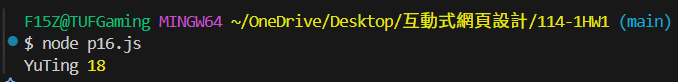
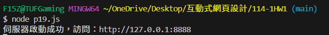
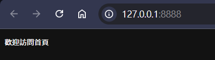
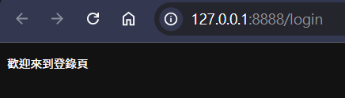
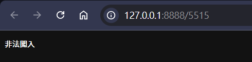
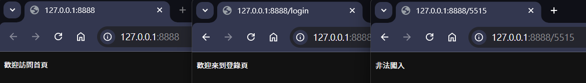

# 第2次隨堂題目-隨堂-QZ2
>
>學號：112111108
><br />
>姓名：詹羽庭
><br />
>作業撰寫時間：60 (mins，包含程式撰寫時間)
><br />
>最後撰寫文件日期：2026/01/02
>

本份文件包含以下主題：(至少需下面兩項，若是有多者可以自行新增)
- [x] 說明內容
- [x] 個人認為完成作業須具備觀念

## 說明程式與內容
1. 請撰寫Topic 1的P. 16，並1 寫程式後印出結果，該程式名為p16.js，與2 承1程式碼中的 Line3下中斷點，並印出此時變數age裡面的值為多少觀察。

Ans:
(1)
```js
//p16.js
var userName = "YuTing";
var age = 18;
console(userName, age);
```
# 印出結果為錯誤：TypeError: console is not a function
在 JavaScript 中，console 為一個物件（object），並非函式，因此無法直接呼叫，需使用其方法如 console.log() 來輸出內容。
(2)
將程式碼更改為
```js
//p16.js
var userName = "YuTing";
var age = 18;
console.log(userName, age);
```
並在Line3下中斷點。
當程式執行至 Line 3 下的中斷點時，變數 age 的值為 18。
由於age 已於第 2 行完成宣告與指定，且在後續程式碼中未再被修改，因此在執行 console.log(userName, age) 前，其值仍維持為 18。
印出結果為



2. 請撰寫Topic 1的P. 19，並1 寫程式後印出結果，該程式名為p19.js，與2 請同樣印出p. 20的三種結果，並說明為何可以造成該種原因

Ans:
```js
//p19.js
//1、引入http模組
const http = require('http');
//2、創建http伺服器
const server = http.createServer(function (request, response) {
const url = request.url; //獲取請求位址
console.log(url)
var answer = ''; //設置回應內容
switch (url) {
case '/':
answer = '歡迎訪問首頁';
break;
case '/login':
answer = '歡迎來到登錄頁';
break;
default:
answer = '非法闖入';
break;
}
response.setHeader('Content-Type', 'text/plain;charset=utf-8'); //設置回應頭編碼為utf-8，避免中文亂碼
response.end(answer);
});
//3、啟動伺服器監聽8888埠
server.listen('8888', function () {
console.log("伺服器啟動成功，訪問：http://127.0.0.1:8888")
})
```
結果如下：

(2)
# p.20 的三種結果
呈上題，依照瀏覽器請求的網址路徑（request.url）不同，會產生三種不同的結果
## 第一種結果：進入首頁
在終端機輸入node p19.js，會輸出網址：http://127.0.0.1:8888/ 
顯示結果：
當使用者存取 / 時，request.url 的值為 '/'，符合 switch 中的 case '/'，因此回傳「歡迎訪問首頁」。
## 第二種結果：進入登入頁
將瀏覽器上網址更改為：http://127.0.0.1:8888/login
顯示結果：
當使用者存取 /login 時，request.url 的值為 '/login'，符合 case '/login'，因此回傳「歡迎來到登錄頁」。
## 第三種結果：其他未知路徑
網址：例如 http://127.0.0.1:8888/5515
顯示結果：
當請求的路徑不符合 / 或 /login 時，會進入 switch 的 default，因此回傳「非法闖入」。

瀏覽器請求的 URL 不同，導致 request.url 的值不同，
而程式透過 switch(url) 判斷請求路徑，回傳對應的回應內容，因此產生不同的顯示結果。


### 個人認為完成作業須具備觀念
#### 1.JavaScript 與 Node.js 基本語法觀念
需了解變數宣告、函式使用方式，以及 console.log() 的正確用法，避免因語法錯誤導致程式無法執行。

#### 2.程式執行流程與除錯觀念
能理解程式由上而下執行，並透過 Visual Studio Code 的中斷點（Breakpoint）功能，觀察程式在不同執行階段時變數的實際值。

#### 3.HTTP 伺服器基本概念
需了解 Node.js 可透過 http.createServer() 建立伺服器，並使用 request 與 response 物件處理瀏覽器請求與回應。

#### 4.URL 路徑判斷與回應機制
能夠理解 request.url 的用途，並依不同網址路徑透過條件判斷（如 switch）回傳對應的內容，形成簡單的路由邏輯。
